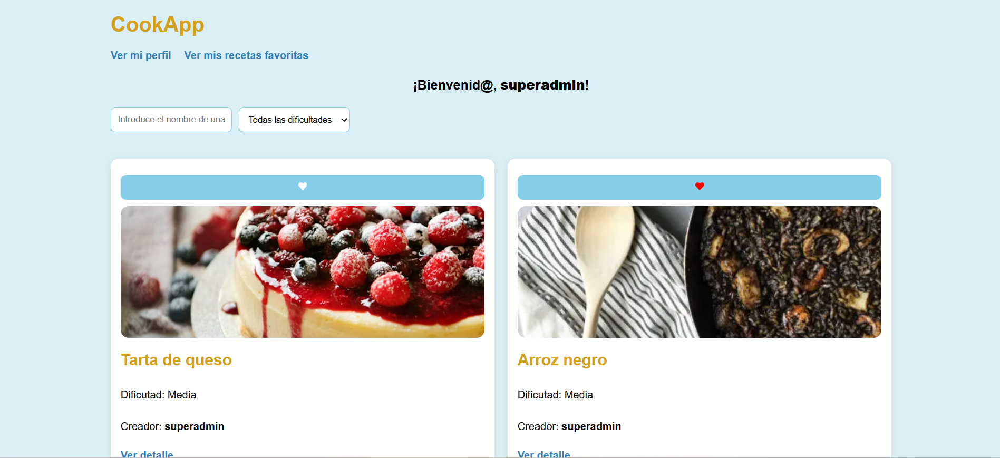
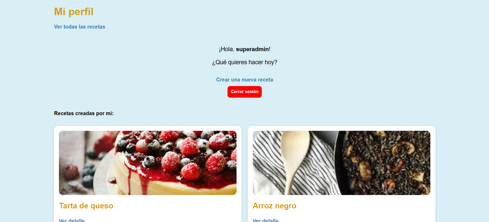
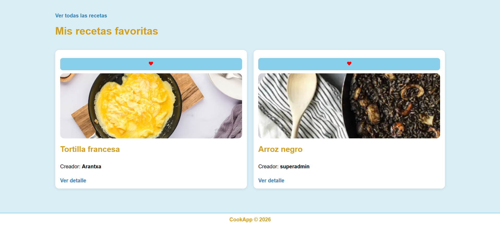

# 🍳 CookApp Frontend

Aplicación frontend de **CookApp**, una plataforma fullstack responsive donde los usuarios pueden descubrir, crear y gestionar recetas de cocina.

---

# 📸 Capturas de la aplicación

## 🏠 Página principal



---

## 👤 Perfil de usuario



---

## ❤️ Favoritos



---

# 🚀 Despliegue

* Frontend: https://lustrous-choux-3c11f9.netlify.app/
* Backend API: https://cookapp-backend-6lg0.onrender.com
* Repositorio Backend: https://github.com/asolermaria/CookApp-Backend.git

---

# ✨ Funcionalidades

* 🔐 Autenticación de usuarios
* 🌐 Contexto global de autenticación con React Context API
* 🛡️ Protección de sesiones mediante Axios Interceptors
* 🔎 Sistema de filtros de recetas
* ❤️ Gestión de recetas favoritas
* 🍳 CRUD completo de recetas
* 📱 Diseño responsive
* 🔄 Navegación con React Router
* 🍪 Persistencia de sesión mediante cookies JWT
* 🖱️ Cards clicables para navegación rápida

---

# 🛠️ Tecnologías utilizadas

* React
* React Router DOM
* Axios
* React Icons
* CSS3
* Vite

---

# 📁 Estructura del proyecto

```bash
src/
├── api/
│   └── axios.js
├── assets/
├── components/
│   ├── Footer.jsx
│   ├── RecipeCard.jsx
│   ├── RecipeFilters.jsx
│   └── RecipeList.jsx
├── context/
│   └── AuthContext.jsx
├── pages/
│   ├── CreateRecipe.jsx
│   ├── EditRecipe.jsx
│   ├── FavouriteRecipes.jsx
│   ├── Home.jsx
│   ├── Login.jsx
│   ├── RecipeDetail.jsx
│   ├── Register.jsx
│   └── UserDashboard.jsx
├── styles/
│   └── index.css
├── App.jsx
└── main.jsx
```

---

# ⚙️ Variables de entorno

Crea un archivo `.env` en la raíz del proyecto:

```env
VITE_API_URL=
```

---

# 📦 Instalación

## Clonar repositorio

```bash
git clone https://github.com/asolermaria/CookApp-Frontend.git
```

## Instalar dependencias

```bash
npm install
```

## Ejecutar entorno de desarrollo

```bash
npm run dev
```

---

# 📚 Funcionalidades principales

## 🔐 Autenticación

Los usuarios pueden:

* Registrarse
* Iniciar sesión
* Cerrar sesión
* Mantener la sesión activa mediante cookies JWT

---

## 🍳 Recetas

Los usuarios pueden:

* Crear recetas
* Editar sus propias recetas
* Eliminar recetas
* Ver detalle de recetas
* Filtrar recetas por nombre y dificultad

---

## ❤️ Favoritos

Los usuarios pueden:

* Añadir recetas a favoritos
* Eliminar favoritos
* Visualizar recetas favoritas

---

# 📱 Diseño responsive

La aplicación utiliza:

* CSS Grid
* Flexbox
* Media Queries

para adaptarse a:

* móvil
* tablet
* desktop

---

# 🌐 Despliegue

* Frontend desplegado en Netlify
* Backend desplegado en Render

La aplicación incluye configuración `_redirects` para React Router:

```txt
/* /index.html 200
```

Esto permite que React Router gestione correctamente las rutas al recargar la página o acceder directamente a una URL.

---

# 👩‍💻 Autor

Desarrollado por Antonio Soler Maria.
